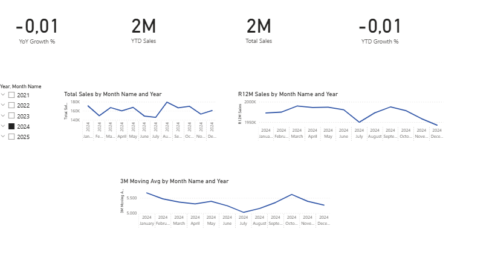
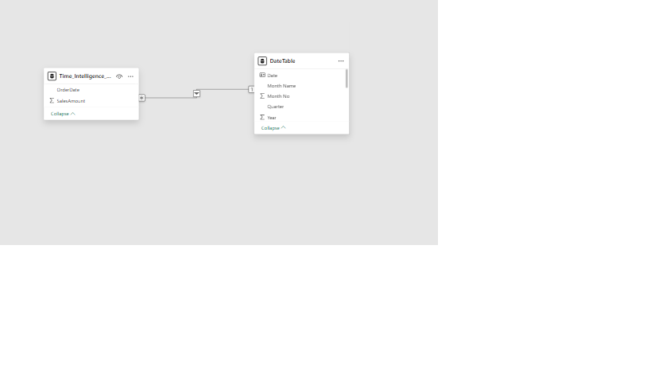

Zaman İstihbaratı Satış Dashboard’u (Power BI)

Bu proje, Power BI kullanarak gelişmiş Zaman İstihbaratı analizi göstermektedir.
Satış performansını yıllık, ay bazlı ve yıllar arası karşılaştırmalı olarak analiz etmeye odaklanır ve 12 aylık rolling trend ile 3 aylık hareketli ortalamalar içerir.

## Dashboard

-KPI kartları ile hızlı bilgi

-Line chart ile Toplam Satış, Rolling 12 Aylık Satış ve 3 Aylık Hareketli Ortalama

-Slicer ile Yıl ve Ay seçimi

## Data Model

-Star schema ile veri modelleme

-Sales tablosu ile Date Table ilişkisi kurulmuş

Özel Tarih Tablosu / Date Table

DateTable = 
ADDCOLUMNS(
    CALENDAR(
        DATE(YEAR(MIN(Time_Intelligence_Project_Sales_Data[OrderDate]))-1,1,1),
        DATE(YEAR(MAX(Time_Intelligence_Project_Sales_Data[OrderDate]))+1,12,31)
    ),
    "Year", YEAR([Date]),
    "Month No", MONTH([Date]),
    "Month Name", FORMAT([Date], "MMMM"),
    "YearMonth", FORMAT([Date], "YYYY-MM"),
    "Quarter", "Q" & FORMAT([Date], "Q")
)

-Kolonlar: Year, Month No, Month Name, Quarter, YearMonth

-Power BI’da Mark as Date Table olarak işaretlenmiş

-Sales tablosundaki OrderDate, DateTable’ın Date kolonu ile ilişkilendirilmiş

Temel Measure’lar

## Toplam Satış
Total Sales = SUM(Time_Intelligence_Project_Sales_Data[SalesAmount])

## YTD Satış
YTD Sales = TOTALYTD([Total Sales], DateTable[Date])

## 3 Aylık Hareketli Ortalama
3M Moving Avg = 
CALCULATE(
    AVERAGEX(
        DATESINPERIOD(
            DateTable[Date],
            MAX(DateTable[Date]),
            -3,
            MONTH
        ),
        [Total Sales]
    )
)

## YTD Büyüme %
YTD Growth % = DIVIDE([YTD Sales] - [Last Year YTD], [Last Year YTD])

## Görselleştirmeler

-KPI Kartları: Toplam Satış, YTD Satış, 3 Aylık Hareketli Ortalama, YTD Büyüme %

-Line Charts / Çizgi Grafikleri:

-Month Name → Toplam Satış

-YearMonth → Rolling 12 Aylık Satış

-YearMonth → 3 Aylık Hareketli Ortalama

-Table / Tablo: Month No kullanılarak kronolojik sıralama

-Slicers / Filtreler: Year, Month Name

## Amacı

-Power BI’da star schema ile veri modelleme göstermek

-Time Intelligence hesaplamalarını trend analizi için uygulamak

-Yönetici kararlarını destekleyecek dashboard oluşturmak

## Öne Çıkan Beceriler

-DAX (TOTALYTD, TOTALMTD, DATEADD, SAMEPERIODLASTYEAR, Rolling & Moving Averages)

-Power BI’da veri modelleme ve ilişkiler

-Gelişmiş görselleştirme teknikleri

-Zaman bazlı analiz ve trend inceleme

## Elde Edilen İçgörüler

-Bölgesel Satış Performansı: Bazı bölgeler toplam satışta diğerlerinden daha yüksek performans göstermektedir.

-Kategori Analizi: Elektronik ve Beyaz Eşya kategorileri satışlarda önemli paya sahiptir.

-Zaman Bazlı Trendler: Yıllar ve aylara göre satışlarda dalgalanmalar gözlemlenmektedir; belirli aylar yüksek satış trendine sahiptir.

-YTD ve Rolling Analizler: YTD Sales ve 12 aylık Rolling Sales sayesinde yıl içerisindeki performans trendleri net şekilde görülebilmektedir.

-Hareketli Ortalama: 3 aylık hareketli ortalama, kısa dönemli dalgalanmaları dengeleyerek daha stabil trend analizi sunmaktadır.

-Filtreleme ile Dinamik Analiz: Year ve Month slicer’ları ile kullanıcı, istediği zaman aralığına odaklanabilir ve detaylı analiz yapabilir.

Time Intelligence Sales Dashboard (Power BI)

This project demonstrates advanced Time Intelligence analysis using Power BI.
It focuses on analyzing sales performance over time, including Year-to-Date (YTD), Month-to-Date (MTD), Year-over-Year (YoY) growth, rolling 12-month trends, and 3-month moving averages.

## Dashboard

-KPI cards for quick insights

-Line charts showing Total Sales, Rolling 12-Month Sales, and 3-Month Moving Average

-Slicers for dynamic Year and Month selection

## Data Model

-Star schema data model

-Connected Sales table’s OrderDate to DateTable’s Date column

Custom Date Table

DateTable = 
ADDCOLUMNS(
    CALENDAR(
        DATE(YEAR(MIN(Time_Intelligence_Project_Sales_Data[OrderDate]))-1,1,1),
        DATE(YEAR(MAX(Time_Intelligence_Project_Sales_Data[OrderDate]))+1,12,31)
    ),
    "Year", YEAR([Date]),
    "Month No", MONTH([Date]),
    "Month Name", FORMAT([Date], "MMMM"),
    "YearMonth", FORMAT([Date], "YYYY-MM"),
    "Quarter", "Q" & FORMAT([Date], "Q")
)

-Columns: Year, Month No, Month Name, Quarter, YearMonth

-Marked as Date Table in Power BI

-OrderDate from Sales table connected to DateTable’s Date column

Key Measures

## Total Sales

Total Sales = SUM(Time_Intelligence_Project_Sales_Data[SalesAmount])

## YTD Sales

YTD Sales = TOTALYTD([Total Sales], DateTable[Date])

## 3-Month Moving Average 

3M Moving Avg = 
CALCULATE(
    AVERAGEX(
        DATESINPERIOD(
            DateTable[Date],
            MAX(DateTable[Date]),
            -3,
            MONTH
        ),
        [Total Sales]
    )
)

## YTD Growth %
YTD Growth % = DIVIDE([YTD Sales] - [Last Year YTD], [Last Year YTD])

## Visualizations

-KPI Cards: Total Sales, YTD Sales, 3-Month Moving Avg, YTD Growth %

-Line Charts:

Month Name → Total Sales

YearMonth → Rolling 12-Month Sales

YearMonth → 3-Month Moving Average

-Table: Sorted by Month No for chronological order

-Slicers: Year, Month Name

## Purpose

-Demonstrates ability to model data in Power BI with star schema

-Implements Time Intelligence calculations for trend analysis

-Creates an executive-friendly dashboard

## Skills Highlighted

-DAX (TOTALYTD, TOTALMTD, DATEADD, SAMEPERIODLASTYEAR, Rolling & Moving Averages)

-Data modeling and relationships in Power BI

-Advanced visualization techniques

-Rolling averages and trend analysis

## Key Insights

-Regional Sales Performance: Certain regions outperform others in total sales.

-Category Analysis: Electronics and White Goods categories contribute significantly to revenue.

-Time-Based Trends: Sales fluctuate across years and months; some months show higher sales trends.

-YTD & Rolling Analysis: YTD Sales and 12-Month Rolling Sales clearly show performance trends within the year.

-Moving Average: The 3-Month Moving Average smooths short-term fluctuations, providing a clearer trend analysis.

-Dynamic Filtering: Year and Month slicers allow users to focus on specific time periods and perform detailed analysis.

